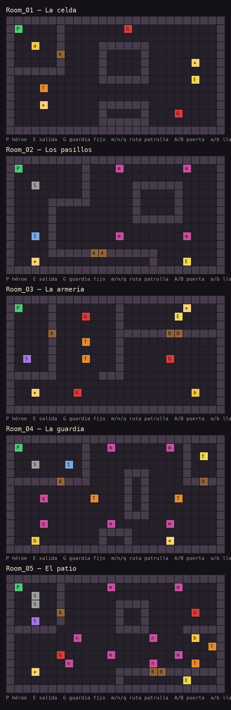

# Mapas de las 5 salas

Las salas se generan desde mapas ASCII en `Assets/Editor/LevelDesigner.cs`
(menú **DungeonPuzzle → Niveles → Construir Room_01-05 desde los mapas**).
Una celda = una unidad del mundo; cada sala mide 26x14 y la cámara se ajusta sola.

## Leyenda

| Símbolo | Significado |
|---|---|
| `#` / `.` | muro / suelo |
| `P` / `E` | aparición del héroe / salida (trampilla) |
| `A`-`D` | puertas (letras contiguas = una puerta más ancha) |
| `a`-`d` | llave de la puerta A-D |
| `1`-`4` | palanca de la puerta A-D |
| `5`-`8` | placa de presión de la puerta A-D (se queda abierta al pisarla) |
| `G` | guardia fijo (barre hacia el espacio abierto) |
| `m` `n` `q` `r` | rutas de patrulla: las celdas de una misma letra son sus puntos |
| `T` | trampa de pinchos (desfasadas entre sí) |
| `S` | piedra lanzable |
| `*` | antorcha (luz puntual) |

## Recorrido previsto

1. **La celda**: llave → puerta, cruzar el corredor entre los dos bloques esquivando al guardia de arriba y al que vigila la salida.
2. **Los pasillos**: la patrulla da vueltas al bloque central; lanzar la piedra al lado contrario, accionar la palanca y bajar a la reja.
3. **La armería**: la placa de la celda abre el pasillo de pinchos; la llave está en la esquina opuesta y abre la reja doble de la sala de la salida.
4. **La guardia**: palanca en la celda, dos patrullas que se cruzan, llave abajo a la izquierda y salida en el cuarto de arriba a la derecha.
5. **El patio**: placa en la celda, dos piedras, tres guardias y dos patrullas; la llave del portón está junto a los pinchos.

Para cambiar un nivel: edita el mapa en el archivo, valida con **Niveles → Validar mapas**
(comprueba anchos, que haya un `P` y un `E`, que cada puerta tenga forma de abrirse y que
la salida sea alcanzable) y vuelve a construir.
