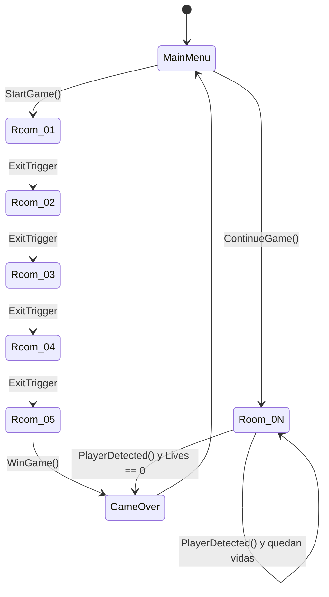
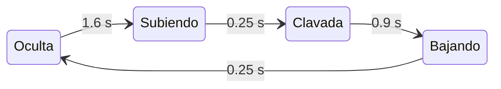

<!--
CÓMO USAR ESTE ARCHIVO

Es el guion completo de la presentación en formato deck. Cada `---` separa una
diapositiva. Los bloques `<!-- NOTAS: ... -->` son lo que dice el ponente, no van
en la lámina. Los `[CAPTURA N]` son huecos para las capturas de Unity; la guía de
cómo tomarlas está en CAPTURAS.md.

Sirve tal cual para Marp, Slidev o reveal-md, y se le puede dar a cualquier
herramienta de diapositivas (Gamma, Canva, PowerPoint, Google Slides) pidiéndole
que respete los saltos de lámina.

PALETA SUGERIDA (sacada de los sprites del propio juego):
  piedra oscura  #3A3842   piedra media  #605E6E   piedra clara  #8C8A9C
  ámbar antorcha #B07A2C   verde placa   #6CE084   rojo alerta   #E0574B
  fondo claro    #F6F5F9   fondo oscuro  #131218
TIPOGRAFÍA SUGERIDA: títulos en una grotesca con carácter (Bricolage Grotesque),
cuerpo en Public Sans, y monoespaciada (JetBrains Mono) para capas y código.
-->

# Colisiones, objetos interactivos y trampas

### DungeonPuzzle · Avance de la Semana 4

Juego de sigilo y puzles top-down en Unity

`Unity 6000.5.0b10` · `URP 2D` · `Input System` · `45 pruebas EditMode`

<!-- NOTAS: Presentar el equipo y encuadrar en una frase: este avance no añade
     contenido nuevo de nivel, arregla y amplía cómo el juego resuelve las
     colisiones, y añade dos elementos accionados por contacto. -->

---

## Lo que cubre este avance

| | |
|---|---|
| **01** | Organización de escenas, objetos, componentes y scripts |
| **02** | Detección y respuesta de colisiones entre objetos 2D |
| **03** | Comportamientos de objetos interactivos |
| **04** | Obstáculo con animación y comportamiento propio |
| **05** | Decisiones de arquitectura para crecer |

<!-- NOTAS: Son los cinco puntos que pide la consigna. Cada uno tiene al menos
     una lámina propia. -->

---

## 01 · Una carpeta por responsabilidad

```
Assets/
├── Scenes/      MainMenu · Room_01..05 · Room_Demo · GameOver
├── Prefabs/     Player, Guard_*, Door, Lever, Key, Stone,
│                PressurePlate*, SpikeTrap*
├── Scripts/
│   ├── Core/    GameManager, GameProgress, AudioMaster,
│   │            SfxLibrary, CollisionLayers*, DemoOverlay*
│   ├── Player/  PlayerMovement, PlayerInteraction,
│   │            PlayerInventory, InteractionSensor*
│   ├── Guard/   GuardBase, GuardStatic, GuardPatrol, VisionCone
│   ├── World/   Door, Lever, Key, Stone, ThrownStone,
│   │            NoiseSource, PressurePlate*, SpikeTrap*
│   ├── UI/ FX/  HUD y pausa · VFX, YSort, sacudidas
│   └── Tests/   EditMode — lógica pura
├── Editor/      RoomBuilder, Semana04Builder*
└── Sprites/ Audio/ Animations/ Resources/
```

`*` = añadido en la Semana 4

<!-- NOTAS: No leer el árbol entero. Señalar la separación Core/Player/Guard/World
     y decir que Tests está dentro de Scripts porque prueba lógica pura. -->

---

## 01 · Tres assemblies, una regla de dependencia

| Assembly | Contenido | ¿Entra al build? |
|---|---|---|
| `DungeonPuzzle.Runtime` | `Assets/Scripts/**` | Sí |
| `DungeonPuzzle.Editor` | `Assets/Editor/**` | No |
| `DungeonPuzzle.Tests` | `Scripts/Tests/**` | No |

**El Editor puede usar el Runtime, nunca al revés.**

Eso garantiza que las herramientas que construyen las salas jamás se cuelen en la
versión jugable.

> `GameManager` se autocrea con `[RuntimeInitializeOnLoadMethod]` y sobrevive a los
> cambios de escena: **cualquier sala se puede ejecutar sola** sin arrancar por el
> menú. Cada integrante prueba la suya sin recorrer el juego entero.

`[CAPTURA 1]` — panel Project con `Scripts/` desplegado y los tres `.asmdef`

<!-- NOTAS: Es la primera decisión de arquitectura y la más barata de explicar. -->

---

## 01 · Flujo de escenas



<!-- NOTAS: El único objeto que sobrevive a los cambios de escena es GameManager.
     GameProgress persiste desbloqueos y mejores tiempos entre sesiones. -->

---

## 01 · Composición sobre herencia

**Player** `capa 6`
- Rigidbody2D dinámico, rotación congelada
- CircleCollider2D sólido `r = 0.4`
- CircleCollider2D **trigger** `r = 1.0` — el sensor de interacción
- PlayerMovement · PlayerInteraction · PlayerInventory · InteractionSensor
- Hijo *Visual*: SpriteRenderer + Animator de 4 direcciones

**Guard_\*** `capa 7`
- Rigidbody2D cinemático con contactos completos
- `GuardBase` → `GuardStatic` o `GuardPatrol`
- Hijo *VisionCone*: malla generada por raycasts
- Hijo *Visual*: contra-rota para verse de pie

`[CAPTURA 2]` — Inspector del Player con sus **dos** Circle Collider 2D

<!-- NOTAS: El mensaje es que un guardia no es una clase gigante: es un GameObject
     que suma cuerpo + cono + visual + una política de movimiento. Cambiar la
     política no toca ni la detección ni la animación. -->

---

## 02 · Punto de partida: todo chocaba contra todo

La matriz de colisiones 2D estaba entera en `ffff…ff`.

| | |
|---|---|
| 🐞 **La piedra empujaba al héroe** | Nacía en su posición exacta y en capa `Default` |
| 🐞 **Atravesaba muros finos** | `r = 0.1` a `8 u/s` con detección discreta |
| 🐞 **El héroe se enganchaba** | `MovePosition` teletransporta: el solver corrige *después* del solape |
| 🐞 **Punto ciego a la espalda** | El cono no llega detrás y el contacto no se comprobaba |
| ⚠️ **Gravedad `-9.81`** | En un juego cenital, confiando en `gravityScale = 0` por prefab |
| ⚠️ **Máscaras vacías** | Un `LayerMask` sin marcar rompía la detección **en silencio** |

<!-- NOTAS: Esta es la lámina que justifica todo el trabajo de la semana. No son
     mejoras cosméticas: son seis fallos concretos, cuatro de ellos visibles al
     jugar. -->

---

## 02 · La matriz, recortada a lo que el juego necesita

| | Player | Guard | Walls | Items | Interact | Projectile | Hazard |
|---|:--:|:--:|:--:|:--:|:--:|:--:|:--:|
| **Player** | — | ✔ | ✔ | ✔ | ✔ | **✘** | ✔ |
| **Guard** | ✔ | **✘** | ✔ | ✘ | ✔ | ✘ | ✘ |
| **Walls** | ✔ | ✔ | ✘ | ✘ | ✘ | ✔ | ✘ |
| **Items** | ✔ | ✘ | ✘ | ✘ | ✘ | ✘ | ✘ |
| **Interactable** | ✔ | ✔ | ✘ | ✘ | ✘ | **✔** | ✘ |
| **Projectile** | **✘** | ✘ | ✔ | ✘ | **✔** | ✘ | ✘ |
| **Hazard** | ✔ | ✘ | ✘ | ✘ | ✘ | ✘ | ✘ |

Capas nuevas: **`Projectile (11)`** y **`Hazard (12)`**. Gravedad global a `(0, 0)`.

`[CAPTURA 3]` — `Project Settings ▸ Physics 2D ▸ Layer Collision Matrix`

<!-- NOTAS: Detenerse en las tres casillas en negrita:
     Player ✘ Projectile  — la piedra ya no empuja a quien la lanza.
     Guard ✘ Guard        — dos cinemáticos solapados generaban contactos inútiles.
     Projectile ✔ Interactable — la piedra choca contra una puerta CERRADA y hace
       ruido ahí; con la puerta abierta la cruza, porque Door.Open() apaga su
       collider. -->

---

## 02 · Detección continua: dejar de atravesar el muro

**Discreta** — el motor solo mira posiciones

```
   ○ · · · · · · · · ▓ · · · · · ○
 paso n              muro       paso n+1
 ninguna de las dos posiciones toca el muro → aparece al otro lado
```

**Continua** — el motor barre el trayecto

```
   ○━━━━━━━━━━━━━━━━●▓
 paso n          impacto detectado en el barrido
```

`r = 0.1` · `v = 8 u/s` · paso de física `0.02 s` → **0.16 u por paso**

**Antes:** el modo dependía de lo que tuviera marcado el prefab, y una piedra que
no golpeaba superficie válida rebotaba **para siempre**.
**Ahora:** `Awake()` fuerza `Continuous` + interpolación, el rebote **refleja la
velocidad sobre la normal del contacto** con pérdida de energía, y `maxLifetime`
garantiza que ninguna piedra sobreviva indefinidamente.

<!-- NOTAS: Es el ejemplo más didáctico de "detección" frente a "respuesta":
     detectar el impacto es el barrido; responder al impacto es el rebote. -->

---

## 02 · Respuesta al muro: de empujón correctivo a deslizamiento

**`MovePosition`** (antes)
1. el cuerpo se teletransporta y **se solapa** con el muro
2. el solver lo corrige a empujones
3. tirón visible; esquinas donde el héroe se queda pegado

**`linearVelocity`** (ahora)
- el solver resuelve el contacto y el héroe **desliza** a lo largo de la pared
- se refuerzan interpolación, rotación congelada y material sin fricción

> **Detalle que se nota al jugar:** el `Animator` recibe la velocidad **real** del
> cuerpo, no la deseada. Al empujar contra un muro el héroe deja de caminar en
> pantalla aunque el jugador siga pulsando la tecla.

`[CAPTURA 4]` — Scene view con *Always Show Colliders* y el héroe pegado a un muro

<!-- NOTAS: Aquí conviene enseñarlo en vivo si da tiempo: caminar en diagonal
     contra la pared. Es la mejora más visible de todas. -->

---

## 02 · De sondear el espacio a escuchar al motor

**Antes — consulta al pulsar E**
- `Physics2D.OverlapCircle` en el instante de la pulsación
- consulta ciega, fuera del ciclo de física
- devolvía **un** collider arbitrario del montón
- nada podía avisar al jugador antes de pulsar

**Ahora — eventos del motor**
- `InteractionSensor` mantiene los candidatos con `OnTriggerEnter2D` / `OnTriggerExit2D`
- es cálculo que la simulación ya hace de todos modos
- coste amortizado y se elige el **más cercano**, no uno cualquiera

⚠️ **Efecto secundario que hubo que blindar:** el jugador pasó a llevar **dos**
colliders, así que cada trigger de la escena recibía el evento dos veces. Sin
protección, `ExitTrigger` cargaba la sala siguiente dos veces —saltándose un
nivel— y la trampa restaba dos vidas. Ambos llevan ahora un pestillo de un solo uso.

<!-- NOTAS: Este es un buen momento para reconocer que una mejora introdujo un
     riesgo nuevo y que se detectó y se cerró. Eso vale más que fingir que salió
     a la primera. -->

---

## 02 · El punto ciego del guardia, cerrado

Un Rigidbody2D **cinemático no reporta contactos** salvo que se le pida.

```csharp
Rb.useFullKinematicContacts = true;
```

`GuardBase` añade `OnCollisionEnter2D`: chocar de frente con un guardia te descubre
al instante, aunque su cono de visión mire al otro lado.

Antes, pegarse a su espalda era impunidad total.

---

## 03 · Seis objetos, tres formas de activarse

| Objeto | Se activa por | Respuesta |
|---|---|---|
| `Key` | trigger + <kbd>E</kbd> | Abre su puerta; **se consume** |
| `Lever` | trigger + <kbd>E</kbd> | Conmuta su puerta |
| `Stone` | <kbd>E</kbd> recoger · <kbd>F</kbd> lanzar | Genera un proyectil |
| `Door` | mensaje de otro objeto | Anima escala y apaga su collider |
| `ExitTrigger` | **solo colisión** | Siguiente sala o victoria |
| `PressurePlate` ★ | **solo colisión** | Mantiene la puerta abierta |

★ = nuevo en la Semana 4

<!-- NOTAS: Las tres formas son: tecla sobre un candidato detectado por trigger,
     mensaje entre objetos, y colisión pura sin intervención del jugador. -->

---

## 03 · Por qué la placa no puede usar un `bool`

Con un par `Enter`/`Exit` y una bandera, basta que haya **dos cuerpos** encima:

1. el héroe entra → `true`
2. otro cuerpo entra → `true`
3. ese otro cuerpo sale → `false`

…y la puerta se cierra con el héroe todavía de pie sobre la placa.

**Ocurre de verdad, y por dos vías:** el héroe aporta **dos colliders** (el sólido y
el trigger del sensor), y un guardia puede pisarla al mismo tiempo.

Por eso lleva un **conjunto de ocupantes** y solo se suelta cuando queda vacío, más
un barrido que descarta ocupantes destruidos: un objeto que desaparece no siempre
emite su `Exit`.

<!-- NOTAS: La regla vive en una función pura, ShouldBePressed(ocupantes, latching,
     yaFijada), cubierta por tests. -->

---

## 03 · Dos cosas que aprendimos peleando con esto

**Una piedra no puede pesar sobre la placa**
Un trigger **no frena** a un cuerpo dinámico: la piedra lanzada la sobrevuela y
produce un `Enter` y un `Exit` en el mismo instante. Aceptarla como ocupante solo
haría **parpadear** la puerta. La placa cuenta únicamente cuerpos que puedan
**reposar** encima: el héroe y los guardias.

**El problema de los dos dueños**
Si una puerta ya la controla una palanca o una llave, bajarse de la placa cerraría
lo que el otro mecanismo abrió. Por eso existe el modo `latching`: en esas salas la
placa solo puede **abrir**.

<!-- NOTAS: Decirlo abiertamente: la primera versión del documento afirmaba que se
     podía lanzar la piedra sobre la placa. Al revisar el código se vio que la
     física no lo permite y se corrigió. Reconocer el error de análisis suma. -->

---

## 04 · SpikeTrap: cuatro fases, tres trampas desfasadas



Ciclo de **3 s**. Solo la fase *Clavada* mata: el collider se **enciende y apaga**
con la fase.

| Trampa | Desfase | Ventana letal dentro del ciclo |
|---|---|---|
| 1 | 0 s | `[1.85 s → 2.75 s)` |
| 2 | 1 s | `[0.85 s → 1.75 s)` |
| 3 | 2 s | `[0.00 s → 0.75 s)` y `[2.85 s → 3.00 s)` |

**Nunca se solapan** (huecos de 0.10 s): siempre hay paso, pero hay que leer el ritmo.

`[CAPTURA 5]` — las tres trampas en Game view, una clavada y dos ocultas

<!-- NOTAS: Un solo prefab. El desfase es un campo serializado, no una copia del
     objeto. Si la herramienta de diapositivas soporta gráficos, esta tabla queda
     mucho mejor como tres barras horizontales desplazadas. -->

---

## 04 · Tres decisiones dentro de la trampa

**Animación por código, no por Animator**
Tres sprites conmutados según la fase. Para cuatro estados deterministas un Animator
es peso muerto, y así la fase **visible** y la fase **lógica** no se pueden
desincronizar.

**El collider se apaga, no se consulta**
Durante la fase inofensiva el motor deja de reportar el contacto por completo, en vez
de reportarlo y descartarlo con un `if`.

**Quien ya estaba encima**
Un cuerpo quieto **no vuelve a emitir** `OnTriggerEnter2D` cuando el collider se
reactiva. Al armarse, un `Collider2D.Overlap` comprueba quién está dentro *en ese
instante*: quedarse parado sobre los pinchos también mata.

<!-- NOTAS: La tercera es el fallo clásico "entré cuando estaba desarmada y nunca me
     mató". Es el detalle que demuestra que se entendió el ciclo de eventos. -->

---

## 04 · El obstáculo complementa al enemigo

El juego ya tenía **`GuardStatic`** (barre un arco) y **`GuardPatrol`** (recorre
waypoints), ambos con animación de 4 direcciones, cono de visión por raycasts y
reacción al ruido.

> **El guardia castiga que te vean.
> La trampa castiga dónde pisas.**

Juntos obligan a leer la sala en dos ejes en vez de uno.

---

## 05 · Decisiones de arquitectura

| Decisión | Qué evita |
|---|---|
| **`CollisionLayers`, fuente única** | Máscaras nombradas por intención; ningún prefab rompe la detección dejando un campo vacío |
| **Herencia solo donde hay jerarquía** | `GuardBase` define el ciclo; las subclases solo aportan *cómo se mueven* |
| **Interfaz `IInteractable`** | El jugador pide un contrato, no conoce `Lever` ni `Door` |
| **Lógica pura fuera del MonoBehaviour** | `PhaseAt`, `ShouldBePressed`, `Bounce`, `SnapFacing` se prueban sin abrir una escena |
| **Servicios estáticos por nombre** | `SfxLibrary` y `Vfx` cargan de `Resources/`: añadir un efecto no toca ningún prefab |
| **Contenido generado por código** | El avance es reproducible y el diff de git, legible |
| **Validador en el menú del editor** | Comprueba capas, matriz y gravedad e imprime OK/FALLA por línea |

<!-- NOTAS: Elegir dos o tres y desarrollarlas; no leer la tabla entera. Las más
     fuertes son CollisionLayers y la lógica pura separada. -->

---

## 05 · Un fallo que encontramos preparando la demo

`Key.OnPickedUp()` abre su puerta **en el acto**, pero la llave se quedaba ocupando
la única ranura del inventario.

Como `TakeItem()` solo se llama al lanzar una piedra, y lanzar exige
`HasItem<Stone>()`, **quien recogía la llave no podía volver a recoger ni lanzar
nada en toda la sala**.

`Room_05` tiene llave y dos piedras: era imposible de completar como se diseñó.

**Solución:** `PickupItem` distingue los objetos que se **consumen** al recogerse (la
llave) de los que se **guardan** (la piedra). Un consumible surte efecto y desaparece
sin tocar la ranura.

<!-- NOTAS: No era un fallo de esta semana, pero salió al recorrer la demo de punta
     a punta. Buen argumento para defender por qué vale la pena montar una sala de
     demostración. -->

---

## 05 · Verificación

**45** casos EditMode · **30** nuevos esta semana · **7** capas de física · **6** salas

**Cómo reproducir el avance**
1. Abrir el proyecto con Unity `6000.5.0b10`
2. Menú `DungeonPuzzle ▸ Semana 04 ▸ Construir todo` — crea los prefabs, los coloca
   en `Room_02..05`, construye `Room_Demo` e imprime el informe de validación
3. `Window ▸ General ▸ Test Runner ▸ EditMode ▸ Run All`
4. Play desde `Room_Demo`, y <kbd>F1</kbd> para el panel de estado

`[CAPTURA 6]` — Test Runner en EditMode, todo en verde

<!-- NOTAS: Lanzar los tests en vivo: tardan menos de un segundo y no hace falta
     entrar en Play Mode. Es la prueba más rápida de que la lógica está cubierta. -->

---

## Demostración

**`Room_Demo`** — banco de pruebas con todas las mecánicas en una pantalla

```
spawn ─▶ bloque para deslizar ─▶ dos piedras ─▶ 3 trampas desfasadas
      ─▶ placa + palanca ─▶ espalda del guardia ─▶ puerta ─▶ salida
```

| # | Qué se demuestra |
|---|---|
| 1 | El héroe **desliza** al rozar el bloque y la animación se detiene contra él |
| 2 | Una piedra al muro lejano: **ruido** → el guardia gira. Otra a la puerta cerrada: **no la atraviesa** |
| 3 | Tres **trampas desfasadas**; con `F1` se lee la fase de cada una |
| 4 | Pisar la placa abre, salirse **cierra**; la palanca abre a mano |
| 5 | Acercarse por la **espalda** del guardia: el contacto te descubre |
| 6 | Cruzar la puerta termina en victoria |

**<kbd>F1</kbd>** muestra en vivo la velocidad real del héroe, el estado de cada
guardia, la fase de cada trampa y cuántos colliders hay sobre la placa.

<!-- NOTAS: ~90 segundos. La palanca junto a la placa es el rescate: si algo se
     tuerce en vivo, abre la puerta a mano y la demostración sigue. -->

---

## Lo que sigue

Con `GuardBase` y `IInteractable` en su sitio, lo siguiente es barato:

- un guardia que **persigue** en vez de patrullar → subclase de `GuardBase`
- una puerta que exige **dos placas a la vez** → composición de `PressurePlate`
- una trampa cuyo **ritmo dependa del ruido** de la sala

Ninguno de los tres obliga a tocar el jugador ni la configuración de física.

### ¿Preguntas?

<!-- NOTAS: Cerrar conectando con el criterio de la consigna: "decisiones de
     arquitectura que faciliten el crecimiento del videojuego". Estos tres ejemplos
     son la prueba de que las decisiones funcionan. -->
