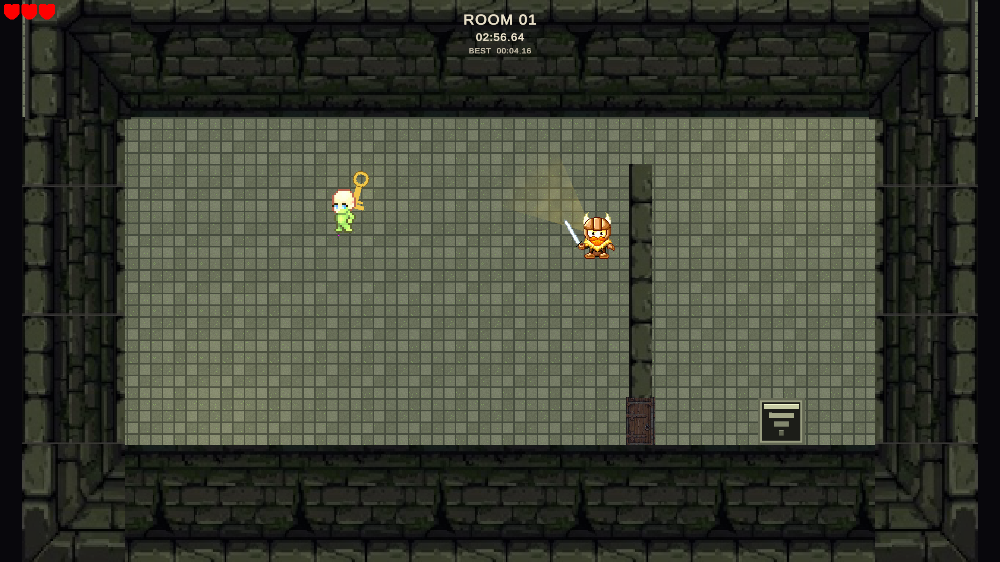
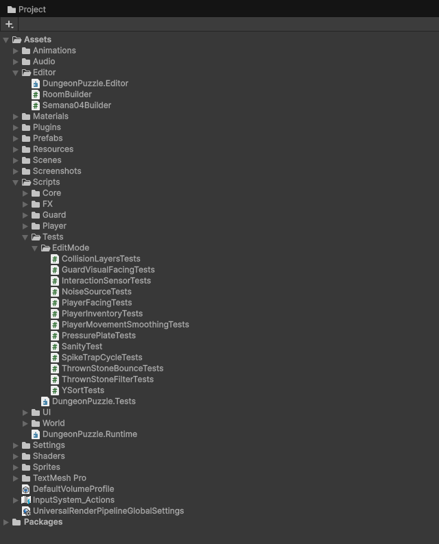
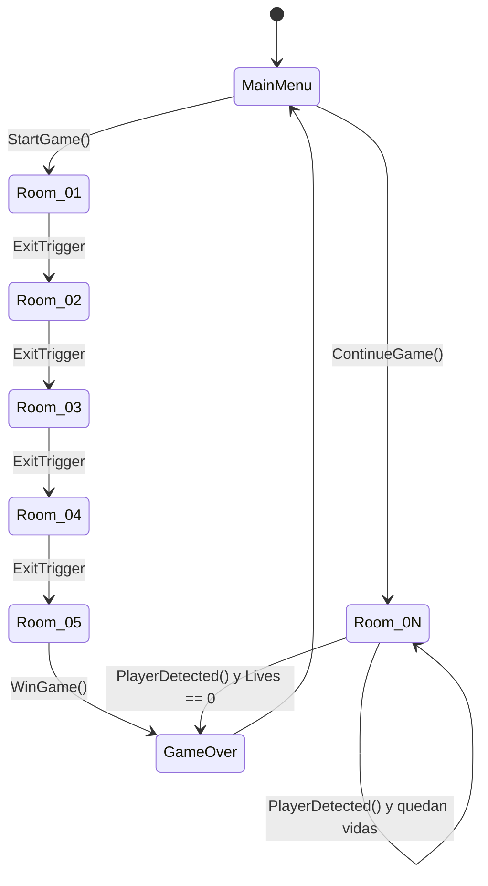
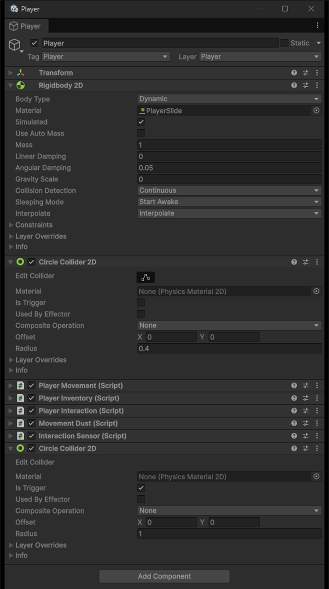
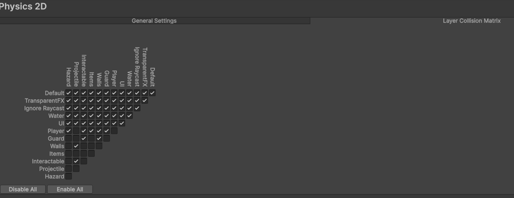
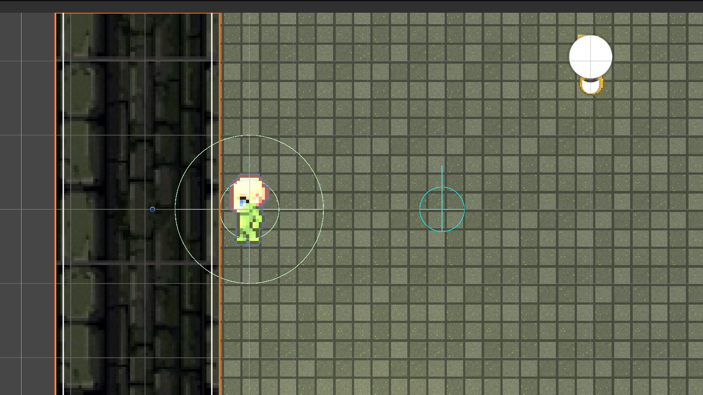
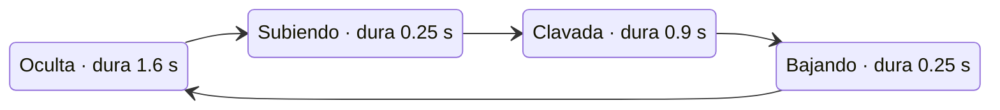
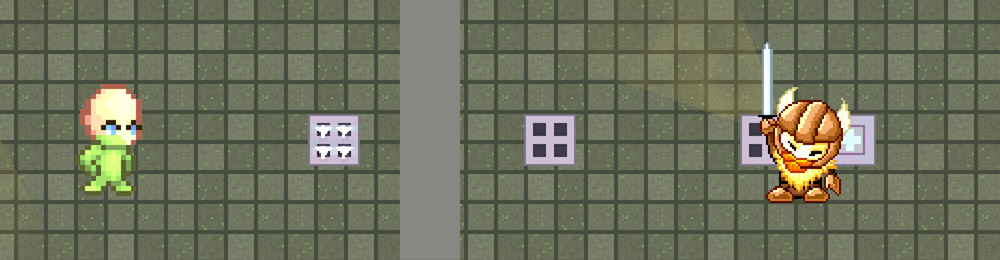
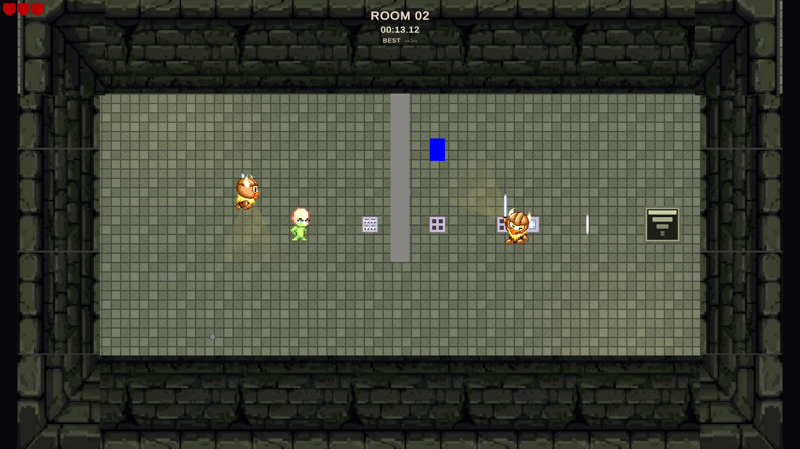
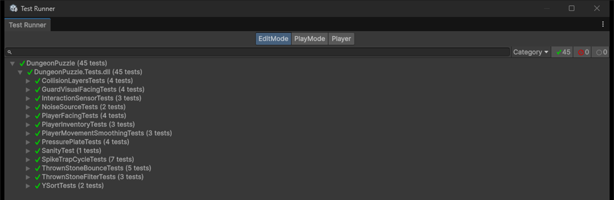

<!--
CÓMO USAR ESTE ARCHIVO

Guion completo de la presentación. Cada `---` separa una diapositiva. Los bloques
`<!-- NOTAS: ... -->` son lo que dice el ponente y no van en la lámina.

Las capturas viven en `capturas/` y ya están referenciadas con su ruta. Si la
herramienta que uses no lee rutas relativas, súbelas a mano en el orden en que
aparecen.

Sirve tal cual para Marp, Slidev o reveal-md. Para Gamma, Canva, PowerPoint o
Google Slides, pídele a la herramienta que respete los saltos de lámina.

PALETA (sacada de los sprites del propio juego):
  piedra oscura  #3A3842   piedra media  #605E6E   piedra clara  #8C8A9C
  ámbar antorcha #B07A2C   verde placa   #6CE084   rojo alerta   #E0574B
  fondo claro    #F6F5F9   fondo oscuro  #131218
TIPOGRAFÍA: títulos en una grotesca con carácter (Bricolage Grotesque), cuerpo en
Public Sans, monoespaciada (JetBrains Mono) para capas y código.
-->

# Colisiones, objetos interactivos y trampas

### DungeonPuzzle · Avance de la Semana 4

Juego de sigilo y puzles top-down en Unity

`Unity 6000.5.0b10` · `URP 2D` · `Input System` · `45 pruebas EditMode`



<!-- NOTAS: Presentar al equipo y encuadrar en una frase: esta semana no añadimos
     contenido de nivel. Arreglamos cómo el juego resuelve las colisiones y metimos
     dos elementos que se accionan por contacto. -->

---

## Lo que cubre este avance

| | |
|---|---|
| 01 | Organización de escenas, objetos, componentes y scripts |
| 02 | Detección y respuesta de colisiones entre objetos 2D |
| 03 | Comportamientos de objetos interactivos |
| 04 | Obstáculo con animación y comportamiento propio |
| 05 | Decisiones de arquitectura para crecer |

<!-- NOTAS: Son los cinco puntos de la consigna. Cada uno tiene al menos una lámina.
     Pasar rápido por aquí. -->

---

## Una carpeta por responsabilidad

```
Assets/
├── Scenes/      MainMenu · Room_01..05 · Room_Demo · GameOver
├── Prefabs/     Player, Guard_*, Door, Lever, Key, Stone,
│                PressurePlate*, SpikeTrap*
├── Scripts/
│   ├── Core/    GameManager, GameProgress, AudioMaster,
│   │            SfxLibrary, CollisionLayers*, DemoOverlay*
│   ├── Player/  PlayerMovement, PlayerInteraction,
│   │            PlayerInventory, InteractionSensor*
│   ├── Guard/   GuardBase, GuardStatic, GuardPatrol, VisionCone
│   ├── World/   Door, Lever, Key, Stone, ThrownStone,
│   │            NoiseSource, PressurePlate*, SpikeTrap*
│   ├── UI/ FX/  HUD y pausa · VFX, YSort, sacudidas
│   └── Tests/   EditMode, lógica pura
├── Editor/      RoomBuilder, Semana04Builder*
└── Sprites/ Audio/ Animations/ Resources/
```

`*` = añadido en la Semana 4

<!-- NOTAS: No leer el árbol. Señalar la separación Core / Player / Guard / World y
     por qué Tests está dentro de Scripts: solo prueba lógica pura. -->

---

## Tres assemblies, una regla de dependencia

| Assembly | Contenido | ¿Entra al build? |
|---|---|---|
| `DungeonPuzzle.Runtime` | `Assets/Scripts/**` | Sí |
| `DungeonPuzzle.Editor` | `Assets/Editor/**` | No |
| `DungeonPuzzle.Tests` | `Scripts/Tests/**` | No |

El Editor puede usar el Runtime, nunca al revés. Con eso, las herramientas que
construyen las salas no pueden colarse en la versión jugable.

`GameManager` se autocrea con `[RuntimeInitializeOnLoadMethod]` y sobrevive a los
cambios de escena, así que cualquier sala se ejecuta sola sin arrancar por el menú.
Cada integrante prueba la suya sin recorrer el juego entero.



<!-- NOTAS: La primera decisión de arquitectura y la más barata de explicar. Si
     preguntan, la regla la impone Unity: un asmdef solo compila contra lo que
     declara en references. -->

---

## Flujo de escenas



<!-- NOTAS: El único objeto que sobrevive a los cambios de escena es GameManager.
     GameProgress guarda desbloqueos y mejores tiempos entre sesiones. -->

---

## Composición sobre herencia

**Player** `capa 6`
- Rigidbody2D dinámico, rotación congelada
- CircleCollider2D sólido `r = 0.4`
- CircleCollider2D trigger `r = 1.0`, que es el sensor de interacción
- PlayerMovement · PlayerInteraction · PlayerInventory · InteractionSensor
- Hijo *Visual*: SpriteRenderer y Animator de 4 direcciones

**Guard_\*** `capa 7`
- Rigidbody2D cinemático con contactos completos
- `GuardBase` → `GuardStatic` o `GuardPatrol`
- Hijo *VisionCone*: malla generada por raycasts
- Hijo *Visual*: contra-rota para verse de pie



<!-- NOTAS: Un guardia no es una clase gigante. Es un GameObject que suma cuerpo,
     cono, visual y una política de movimiento. Cambiar la política de quieto a
     patrulla no toca la detección ni la animación. En la captura se ven los dos
     colliders del jugador, que dan guerra más adelante. -->

---

## Punto de partida: todo chocaba contra todo

La matriz de colisiones 2D estaba entera en `ffff…ff`.

| | |
|---|---|
| La piedra empujaba al héroe | Nacía en su posición exacta y en capa `Default` |
| Atravesaba muros finos | `r = 0.1` a `8 u/s` con detección discreta |
| El héroe se enganchaba | `MovePosition` teletransporta y el solver corrige *después* del solape |
| Punto ciego a la espalda | El cono no llega detrás y el contacto no se comprobaba |
| Gravedad `-9.81` | En un juego cenital, confiando en `gravityScale = 0` prefab por prefab |
| Máscaras vacías | Un `LayerMask` sin marcar rompía la detección en silencio |

<!-- NOTAS: Esta lámina justifica el trabajo de toda la semana. Seis fallos
     concretos, cuatro de ellos visibles jugando. Los dos últimos son los peores,
     porque no dan error: simplemente dejan de detectar. -->

---

## La matriz, recortada a lo que el juego necesita

| | Player | Guard | Walls | Items | Interact | Projectile | Hazard |
|---|:--:|:--:|:--:|:--:|:--:|:--:|:--:|
| **Player** | — | ✔ | ✔ | ✔ | ✔ | **✘** | ✔ |
| **Guard** | ✔ | **✘** | ✔ | ✘ | ✔ | ✘ | ✘ |
| **Walls** | ✔ | ✔ | ✘ | ✘ | ✘ | ✔ | ✘ |
| **Items** | ✔ | ✘ | ✘ | ✘ | ✘ | ✘ | ✘ |
| **Interactable** | ✔ | ✔ | ✘ | ✘ | ✘ | **✔** | ✘ |
| **Projectile** | **✘** | ✘ | ✔ | ✘ | **✔** | ✘ | ✘ |
| **Hazard** | ✔ | ✘ | ✘ | ✘ | ✘ | ✘ | ✘ |

Capas nuevas: `Projectile (11)` y `Hazard (12)`. Gravedad global a `(0, 0)`.



<!-- NOTAS: Detenerse en las tres casillas marcadas.
     Player ✘ Projectile: la piedra ya no empuja a quien la lanza.
     Guard ✘ Guard: dos cinemáticos solapados generaban contactos inútiles.
     Projectile ✔ Interactable: la piedra choca contra una puerta CERRADA y hace
     ruido ahí. Con la puerta abierta la cruza, porque Door.Open() apaga su
     collider. -->

---

## Detección continua: dejar de atravesar el muro

Discreta, el motor solo mira posiciones:

```
   ○ · · · · · · · · ▓ · · · · · ○
 paso n              muro       paso n+1
 ninguna de las dos posiciones toca el muro → aparece al otro lado
```

Continua, el motor barre el trayecto:

```
   ○━━━━━━━━━━━━━━━━●▓
 paso n          impacto detectado en el barrido
```

`r = 0.1` · `v = 8 u/s` · paso de física `0.02 s` → **0.16 u por paso**

Antes, el modo de detección dependía de lo que tuviera marcado el prefab, y una
piedra que no golpeaba superficie válida rebotaba para siempre. Ahora `Awake()`
fuerza `Continuous` más interpolación, el rebote refleja la velocidad sobre la
normal del contacto con pérdida de energía, y `maxLifetime` corta la vida de
cualquier piedra perdida.

<!-- NOTAS: Es el mejor ejemplo de la diferencia entre detectar y responder.
     Detectar el impacto es el barrido; responder al impacto es el rebote. -->

---

## Del empujón correctivo al deslizamiento

`MovePosition`, como estaba antes:

1. el cuerpo se teletransporta y se solapa con el muro
2. el solver lo corrige a empujones
3. tirón visible, y esquinas donde el héroe se queda pegado

`linearVelocity`, como está ahora: el solver resuelve el contacto y el héroe desliza
a lo largo de la pared. De paso se refuerzan interpolación, rotación congelada y
material sin fricción.

Hay un detalle que se nota al jugar. El `Animator` recibe la velocidad real del
cuerpo, no la que pide el jugador. Al empujar contra un muro el héroe deja de
caminar en pantalla aunque sigas pulsando la tecla.



<!-- NOTAS: Enseñarlo en vivo si da tiempo: caminar en diagonal contra la pared. Es
     la mejora más visible de todas y la que más se nota con el mando en la mano. -->

---

## De sondear el espacio a escuchar al motor

Antes, la consulta salía al pulsar <kbd>E</kbd>: un `Physics2D.OverlapCircle` a
ciegas, fuera del ciclo de física, que devolvía un collider cualquiera del montón.
Nada podía avisar al jugador antes de la pulsación.

Ahora `InteractionSensor` mantiene los candidatos con `OnTriggerEnter2D` y
`OnTriggerExit2D`. Es cálculo que la simulación ya hace de todos modos, así que el
coste queda amortizado y se elige el más cercano.

Eso nos abrió un agujero nuevo. El jugador pasó a llevar dos colliders, así que cada
trigger de la escena recibía el evento dos veces. Sin protección, `ExitTrigger`
cargaba la sala siguiente dos veces y te saltabas un nivel; la trampa restaba dos
vidas de golpe. Los dos llevan ahora un pestillo de un solo uso.

<!-- NOTAS: Buen momento para reconocer que una mejora abrió un riesgo nuevo, que lo
     detectamos y lo cerramos. Eso vale más que fingir que salió a la primera. Si
     preguntan cómo lo vimos: recorriendo la demo entera de punta a punta. -->

---

## El punto ciego del guardia, cerrado

Un Rigidbody2D cinemático no reporta contactos salvo que se le pida:

```csharp
Rb.useFullKinematicContacts = true;
```

`GuardBase` añade `OnCollisionEnter2D`. Chocar de frente con un guardia te descubre
al instante, aunque su cono mire al otro lado.

Antes, pegarse a su espalda era impunidad total.

---

## Seis objetos, tres formas de activarse

| Objeto | Se activa por | Respuesta |
|---|---|---|
| `Key` | trigger + <kbd>E</kbd> | Abre su puerta y se consume |
| `Lever` | trigger + <kbd>E</kbd> | Conmuta su puerta |
| `Stone` | <kbd>E</kbd> recoger · <kbd>F</kbd> lanzar | Genera un proyectil |
| `Door` | mensaje de otro objeto | Anima escala y apaga su collider |
| `ExitTrigger` | solo colisión | Siguiente sala o victoria |
| `PressurePlate` ★ | solo colisión | Mantiene la puerta abierta |

★ = nuevo en la Semana 4

<!-- NOTAS: Las tres formas son: tecla sobre un candidato que detectó un trigger,
     mensaje entre objetos, y colisión pura sin que el jugador pulse nada. -->

---

## Por qué la placa no puede usar un `bool`

Con un par `Enter`/`Exit` y una bandera, basta que haya dos cuerpos encima:

1. el héroe entra → `true`
2. otro cuerpo entra → `true`
3. ese otro cuerpo sale → `false`

Y la puerta se cierra con el héroe todavía de pie sobre la placa.

No es un caso rebuscado: pasa por dos vías distintas. El héroe aporta dos colliders,
el sólido y el trigger del sensor. Y un guardia puede pisarla al mismo tiempo.

Por eso la placa lleva un conjunto de ocupantes y solo se suelta cuando queda vacío.
Además hace un barrido para descartar ocupantes destruidos, porque un objeto que
desaparece no siempre emite su `Exit`.

<!-- NOTAS: La regla vive en una función pura, ShouldBePressed(ocupantes, latching,
     yaFijada), y está cubierta por tests. Si preguntan por qué una función estática:
     porque así se prueba sin instanciar una escena. -->

---

## Dos cosas que aprendimos peleando con esto

### Una piedra no puede pesar sobre la placa

Un trigger no frena a un cuerpo dinámico. La piedra lanzada la sobrevuela y produce un `Enter` y un `Exit` en el
mismo instante, así que aceptarla como ocupante solo haría parpadear la puerta. La
placa cuenta únicamente cuerpos que puedan reposar encima: el héroe y los guardias.

### El problema de los dos dueños

Si una puerta ya la controla una palanca o una llave, bajarse de la placa cerraría lo que el otro mecanismo abrió. Para eso existe
el modo `latching`: en esas salas la placa solo puede abrir.

<!-- NOTAS: Decirlo abiertamente. La primera versión de nuestra documentación
     afirmaba que se podía lanzar la piedra sobre la placa para mantenerla accionada.
     Al revisar el código vimos que la física no lo permite y lo corregimos.
     Reconocer un error de análisis propio suma más que esconderlo. -->

---

## SpikeTrap: cuatro fases y tres trampas desfasadas



Ciclo de 3 s. Solo *Clavada* mata, y el collider se enciende y se apaga con la fase.

| Trampa | Desfase | Ventana letal dentro del ciclo |
|---|---|---|
| 1 | 0 s | `[1.85 s → 2.75 s)` |
| 2 | 1 s | `[0.85 s → 1.75 s)` |
| 3 | 2 s | `[0.00 s → 0.75 s)` y `[2.85 s → 3.00 s)` |

Las ventanas nunca se solapan, con huecos de 0.10 s entre ellas. Siempre hay paso,
pero hay que leer el ritmo.



<!-- NOTAS: OJO con las duraciones, que es fácil equivocarse: Oculta 1.6, Subiendo
     0.25, Clavada 0.9, Bajando 0.25. Un solo prefab; el desfase es un campo
     serializado, no una copia del objeto. En la captura se ven dos trampas en fases
     distintas: una con los pinchos fuera y otra con los agujeros vacíos. -->

---

## Tres decisiones dentro de la trampa

### Animación por código, no por Animator

Tres sprites conmutados según la fase.
Para cuatro estados deterministas un Animator es peso muerto, y así la fase visible y
la lógica no se pueden desincronizar.

### El collider se apaga en vez de consultarse

Durante la fase inofensiva el motor
deja de reportar el contacto por completo, en lugar de reportarlo para descartarlo
con un `if`.

### Quien ya estaba encima

Un cuerpo quieto no vuelve a emitir `OnTriggerEnter2D`
cuando el collider se reactiva. Al armarse, un `Collider2D.Overlap` comprueba quién
está dentro en ese instante, así que quedarse parado sobre los pinchos también mata.



<!-- NOTAS: La tercera es el fallo clásico de "entré cuando estaba desarmada y nunca
     me mató". Es el detalle que demuestra que entendimos el ciclo de eventos. -->

---

## El obstáculo complementa al enemigo

El juego ya tenía `GuardStatic`, que barre un arco, y `GuardPatrol`, que recorre
waypoints. Los dos con animación de 4 direcciones, cono de visión por raycasts y
reacción al ruido.

Se complementan bien: al guardia lo esquivas mirando adónde apunta, y a la trampa
mirando cuándo pisas. Con los dos en la misma sala hay que atender a dos cosas a la
vez en lugar de una.

---

## Decisiones de arquitectura

| Decisión | Qué evita |
|---|---|
| `CollisionLayers`, fuente única | Máscaras nombradas por intención; ningún prefab rompe la detección dejando un campo vacío |
| Herencia solo donde hay jerarquía | `GuardBase` define el ciclo; las subclases solo aportan *cómo se mueven* |
| Interfaz `IInteractable` | El jugador pide un contrato y no conoce `Lever` ni `Door` |
| Lógica pura fuera del MonoBehaviour | `PhaseAt`, `ShouldBePressed`, `Bounce`, `SnapFacing` se prueban sin abrir una escena |
| Servicios estáticos por nombre | `SfxLibrary` y `Vfx` cargan de `Resources/`, así que añadir un efecto no toca ningún prefab |
| Contenido generado por código | El avance es reproducible y el diff de git queda legible |
| Validador en el menú del editor | Comprueba capas, matriz y gravedad, e imprime OK o FALLA por línea |

<!-- NOTAS: Elegir dos y desarrollarlas, no leer la tabla entera. Las más fuertes son
     CollisionLayers y la lógica pura separada. -->

---

## Un fallo que encontramos preparando la demo

`Key.OnPickedUp()` abre su puerta en el acto, pero la llave se quedaba ocupando la
única ranura del inventario.

Como `TakeItem()` solo se llama al lanzar una piedra, y lanzar exige
`HasItem<Stone>()`, quien recogía la llave no podía volver a recoger ni lanzar nada
en toda la sala.

`Room_05` tiene llave y dos piedras. Era imposible de completar como la habíamos
diseñado.

`PickupItem` distingue ahora los objetos que se consumen al recogerse, como la llave,
de los que se guardan, como la piedra. Un consumible surte efecto y desaparece sin
tocar la ranura.

<!-- NOTAS: No era un fallo de esta semana, pero salió al recorrer la demo de punta a
     punta. Es el mejor argumento para defender por qué montamos una sala de
     demostración en vez de improvisar sobre las salas del juego. -->

---

## Verificación

**45** casos EditMode · **30** nuevos esta semana · **7** capas de física · **6** salas

Cómo reproducir el avance:

1. Abrir el proyecto con Unity `6000.5.0b10`
2. Menú `DungeonPuzzle ▸ Semana 04 ▸ Construir todo`, que crea los prefabs, los
   coloca en `Room_02..05`, construye `Room_Demo` e imprime el informe de validación
3. `Window ▸ General ▸ Test Runner ▸ EditMode ▸ Run All`
4. Play desde `Room_Demo`, y <kbd>F1</kbd> para el panel de estado



<!-- NOTAS: Lanzar los tests en vivo. Tardan menos de un segundo y no hace falta
     entrar en Play Mode. Es la prueba más rápida de que la lógica está cubierta. -->

---

## Demostración

`Room_Demo`, banco de pruebas con todas las mecánicas en una pantalla:

```
spawn ─▶ bloque para deslizar ─▶ dos piedras ─▶ 3 trampas desfasadas
      ─▶ placa + palanca ─▶ espalda del guardia ─▶ puerta ─▶ salida
```

| # | Qué se demuestra |
|---|---|
| 1 | El héroe desliza al rozar el bloque y la animación se detiene contra él |
| 2 | Una piedra al muro lejano hace ruido y el guardia gira. Otra a la puerta cerrada no la atraviesa |
| 3 | Tres trampas desfasadas; con `F1` se lee la fase de cada una |
| 4 | Pisar la placa abre y salirse cierra; la palanca abre a mano |
| 5 | Acercarse por la espalda del guardia: el contacto te descubre |
| 6 | Cruzar la puerta termina en victoria |

<kbd>F1</kbd> muestra en vivo la velocidad real del héroe, el estado de cada guardia,
la fase de cada trampa y cuántos colliders hay sobre la placa.

<!-- NOTAS: Unos 90 segundos. La palanca junto a la placa es el rescate: si algo se
     tuerce delante de todos, abre la puerta a mano y la demostración sigue. -->

---

## Lo que sigue

Con `GuardBase` y `IInteractable` en su sitio, lo siguiente sale barato:

- un guardia que persigue en lugar de patrullar, como subclase de `GuardBase`
- una puerta que exige dos placas a la vez, componiendo `PressurePlate`
- una trampa cuyo ritmo dependa del ruido de la sala

Ninguno de los tres obliga a tocar el jugador ni la configuración de física.

### ¿Preguntas?

<!-- NOTAS: Cerrar conectando con el criterio de la consigna: decisiones de
     arquitectura que faciliten el crecimiento del videojuego. Estos tres ejemplos
     son la prueba de que las decisiones funcionan. -->
