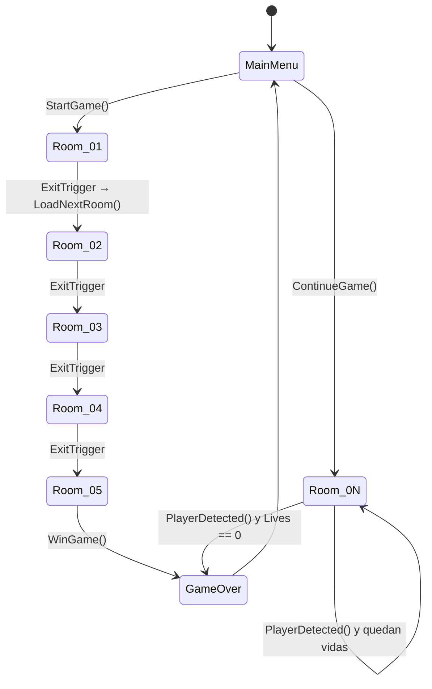
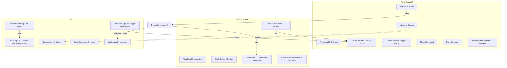
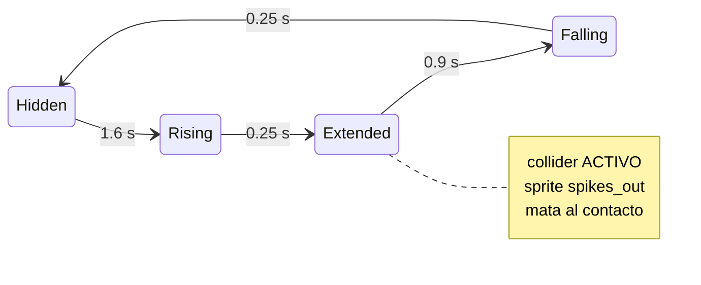

# Semana 04 — Avance del proyecto: colisiones, objetos interactivos y obstáculos

**Proyecto:** DungeonPuzzle — juego de sigilo y puzles top-down 2D
**Motor:** Unity `6000.5.0b10` · Universal Render Pipeline (2D Renderer) · Input System
**Rama:** `feat/semana04-colisiones`

Este documento cubre los cinco puntos pedidos para la Semana 4. Cada sección
enlaza a los archivos reales del repositorio para que se puedan revisar en la
sustentación.

> **Antes de probar:** los prefabs `PressurePlate` y `SpikeTrap` y su colocación
> en las salas se generan con el menú **`DungeonPuzzle ▸ Semana 04 ▸ Construir
> todo`** (ver §6). Lo que está versionado en git son los scripts, los sprites,
> las pruebas y la configuración de física; los assets binarios los produce el
> editor para que el diff del repositorio siga siendo legible. Es el mismo
> criterio que ya seguía `RoomBuilder` para las salas 03-05.

---

## 1. Organización del proyecto

### 1.1 Estructura de carpetas

```
Assets/
├── Scenes/           MainMenu · Room_01..Room_05 · GameOver
├── Prefabs/          Player, Guard_Static, Guard_Patrol, Door, Lever, Key,
│                     Stone, ThrownStone, PressurePlate*, SpikeTrap*
├── Scripts/
│   ├── Core/         GameManager, GameProgress, AudioMaster, SfxLibrary,
│   │                 SpawnPoint, CollisionLayers*
│   ├── Player/       PlayerMovement, PlayerInteraction, PlayerInventory,
│   │                 InteractionSensor*
│   ├── Guard/        GuardBase, GuardStatic, GuardPatrol, VisionCone,
│   │                 GuardVisual, GuardBody
│   ├── World/        Door, Lever, Key, Stone, ThrownStone, PickupItem,
│   │                 NoiseSource, ExitTrigger, IInteractable,
│   │                 PressurePlate*, SpikeTrap*
│   ├── UI/           HUDManager, PauseMenu, MainMenuUI, GameOverUI
│   ├── FX/           Vfx, Flipbook, CameraShake, DetectionFlash, YSort, ...
│   └── Tests/        EditMode — pruebas de la lógica pura
├── Editor/           RoomBuilder, Semana04Builder*  (herramientas, no van al build)
├── Sprites/, Audio/, Animations/, Materials/, Settings/
└── Resources/        VFX/ y Audio/ cargados por nombre en tiempo de ejecución

* = añadido o creado en la Semana 4
```

La separación en tres *assembly definitions* no es decorativa: marca qué código
puede depender de qué.

| Assembly | Contenido | Entra al build |
|---|---|---|
| `DungeonPuzzle.Runtime` | `Assets/Scripts/**` | Sí |
| `DungeonPuzzle.Editor` | `Assets/Editor/**` | No |
| `DungeonPuzzle.Tests` | `Assets/Scripts/Tests/**` | No |

El Editor puede usar el Runtime, nunca al revés. Eso garantiza que las
herramientas de construcción de salas jamás se cuelen en la versión jugable.

### 1.2 Escenas y flujo



`GameManager` es el único objeto que sobrevive a los cambios de escena
(`DontDestroyOnLoad`). Se autocrea con `[RuntimeInitializeOnLoadMethod]`, así que
**cualquier sala se puede ejecutar sola desde el editor** sin arrancar por el
menú: es una decisión pensada para que el equipo pueda probar su propia sala sin
recorrer el juego entero.

### 1.3 Composición de objetos



El patrón es **composición sobre herencia**: un guardia no es una clase gigante,
es un GameObject que suma cuerpo físico + cono de visión + visual animado +
una política de movimiento. Cambiar la política (`GuardStatic` ↔ `GuardPatrol`)
no toca ni la detección ni la animación.

---

## 2. Detección y respuesta de colisiones 2D

Esta es la parte central del avance. Se atacaron cinco problemas concretos.

### 2.1 La matriz de colisiones estaba completamente abierta

**Antes:** `ProjectSettings/Physics2DSettings.asset` tenía la matriz a `ff…ff`:
todas las capas chocaban contra todas. El motor evaluaba pares que jamás pueden
interactuar (muro contra muro, objeto contra objeto) y —peor— pares que
*no deben* interactuar.

**Ahora:** se añadieron las capas `Projectile` (11) y `Hazard` (12) y se
configuró la matriz explícitamente:

| | Player | Guard | Walls | Items | Interact. | Projectile | Hazard |
|---|:--:|:--:|:--:|:--:|:--:|:--:|:--:|
| **Player** | – | ✔ | ✔ | ✔ | ✔ | ✘ | ✔ |
| **Guard** | ✔ | ✘ | ✔ | ✘ | ✔ | ✘ | ✘ |
| **Walls** | ✔ | ✔ | ✘ | ✘ | ✘ | ✔ | ✘ |
| **Items** | ✔ | ✘ | ✘ | ✘ | ✘ | ✘ | ✘ |
| **Interactable** | ✔ | ✔ | ✘ | ✘ | ✘ | ✔ | ✘ |
| **Projectile** | ✘ | ✘ | ✔ | ✘ | ✔ | ✘ | ✘ |
| **Hazard** | ✔ | ✘ | ✘ | ✘ | ✘ | ✘ | ✘ |

Las tres casillas que arreglan bugs reales:

- **Player ✘ Projectile** — la piedra nace *encima* del jugador; antes lo
  empujaba al lanzarla.
- **Guard ✘ Guard** — dos guardias cinemáticos solapados generaban contactos
  inútiles cada frame.
- **Projectile ✔ Interactable** — una piedra lanzada contra una puerta **cerrada**
  choca y hace ruido ahí en vez de atravesarla; contra una puerta abierta pasa,
  porque `Door.Open()` apaga su collider.

La gravedad global pasó de `(0, -9.81)` a `(0, 0)`: es un juego cenital, y
depender de que cada prefab recuerde poner `gravityScale = 0` es frágil.

### 2.2 Tunneling de la piedra lanzada

La piedra mide `r = 0.1` y vuela a `8 u/s`. Con detección **discreta** avanza
`0.16 u` por paso de física: contra un muro fino podía aparecer al otro lado sin
generar contacto.

`ThrownStone.Awake()` fuerza ahora `CollisionDetectionMode2D.Continuous` +
interpolación, y no lo deja al criterio del prefab.
[`ThrownStone.cs`](../../Assets/Scripts/World/ThrownStone.cs)

### 2.3 La respuesta a la colisión: de "parar" a "rebotar"

Antes cualquier impacto que no fuera un muro simplemente no hacía nada, y la
piedra quedaba rebotando por la física por defecto para siempre. Ahora:

- si la superficie está en `NoiseSurfacesMask` → sonido, chispa, aviso a los
  guardias vía `NoiseSource` y destrucción;
- si no → **rebote calculado** reflejando la velocidad sobre la normal del
  contacto con pérdida de energía (`Bounce`), que es una función pura y testeada;
- y en todo caso, `maxLifetime` garantiza que ninguna piedra se quede viva
  indefinidamente.

### 2.4 El jugador se enganchaba en las esquinas

`PlayerMovement` usaba `Rigidbody2D.MovePosition`, que **teletransporta** el
cuerpo: el solver solo puede corregir el solape *después* de que ocurra, lo que
produce tirones al rozar un muro y esquinas donde el héroe se queda pegado.

Ahora se fija `linearVelocity` y es el solver quien resuelve el contacto: el
jugador **desliza** a lo largo de la pared, que es la respuesta esperada en un
top-down. Se refuerzan además interpolación, rotación congelada y un material
sin fricción. [`PlayerMovement.cs`](../../Assets/Scripts/Player/PlayerMovement.cs)

Detalle de pulido: el `Animator` recibe la velocidad **real** del cuerpo, no la
deseada, así que al empujar contra un muro el héroe deja de caminar en pantalla.

### 2.5 De consulta espacial a eventos del motor

`PlayerInteraction` resolvía "¿qué tengo cerca?" con un `Physics2D.OverlapCircle`
en el instante de pulsar `E`: una consulta ciega, fuera del ciclo de física, que
devolvía **un** collider arbitrario y no permitía avisar al jugador antes.

El nuevo [`InteractionSensor`](../../Assets/Scripts/Player/InteractionSensor.cs)
mantiene el conjunto de candidatos con `OnTriggerEnter2D` / `OnTriggerExit2D`
—cálculo que el motor ya hace durante la simulación— y expone
`Closest<T>(mascara)`. Coste amortizado, selección del más cercano y no de uno
cualquiera, y el HUD puede anunciar el objetivo antes de la pulsación.

### 2.6 Punto ciego a la espalda del guardia

El cono de visión no cubre la espalda, así que pegarse a un guardia era
impunidad total. `GuardBase` activa `useFullKinematicContacts` (sin él un cuerpo
cinemático **no reporta contactos**) y añade `OnCollisionEnter2D`: el choque
físico descubre al héroe al instante.
[`GuardBase.cs`](../../Assets/Scripts/Guard/GuardBase.cs)

---

## 3. Objetos interactivos

| Objeto | Se activa por | Respuesta |
|---|---|---|
| `Key` | Trigger + tecla `E` (`PickupItem`) | Abre su puerta, VFX y SFX |
| `Lever` | Trigger + tecla `E` (`IInteractable`) | Conmuta su puerta |
| `Stone` | Trigger + `E` recoger, `F` lanzar | Genera un `ThrownStone` |
| `Door` | Mensaje de otro objeto | Anima escala + apaga su collider |
| `Key` ★ | Trigger + `E` | Se **consume**: ya no ocupa el inventario |
| `ExitTrigger` | `OnTriggerEnter2D` | Siguiente sala o victoria |
| **`PressurePlate`** ★ | **Solo colisión, sin tecla** | Mantiene la puerta abierta |

★ = nuevo en la Semana 4.

### La placa de presión y por qué no basta con un `bool`

[`PressurePlate.cs`](../../Assets/Scripts/World/PressurePlate.cs) es el caso que
obliga a distinguir **entrada** de **permanencia**. Un par
`OnTriggerEnter2D`/`OnTriggerExit2D` con una bandera booleana falla en cuanto hay
dos cuerpos encima: el héroe entra (`true`), la piedra entra (`true`), la piedra
sale (`false`) — y la puerta se cierra con el héroe todavía de pie sobre la placa.

Por eso se lleva un **conjunto de ocupantes** y la placa se suelta solo cuando
queda vacío. A eso se suma un barrido que descarta ocupantes destruidos o
desactivados: un objeto que desaparece no siempre emite su `Exit`.

Ocurre de verdad, y por dos vías: el héroe aporta **dos** colliders (el sólido y
el trigger del sensor), y un guardia puede pisar la placa al mismo tiempo.

Solo cuentan cuerpos que puedan **reposar** encima —el héroe y los guardias—. Una
piedra en vuelo no: un trigger no frena a un cuerpo dinámico, así que la
sobrevuela y solo produciría un `Enter` y un `Exit` en el mismo instante, con la
puerta parpadeando.

La regla vive en una función pura, `ShouldBePressed(ocupantes, latching, yaFijada)`,
cubierta por tests. El modo `latching` (una vez pisada, queda accionada) es lo
que permite colocar la placa en salas donde la puerta ya la controla una palanca
o una llave sin que un mecanismo cierre lo que abrió el otro.

### Un callejón sin salida en el inventario

Revisando el recorrido de la demo apareció un fallo que no era de la Semana 4 pero
la rompía: `Key.OnPickedUp()` abre su puerta **en el acto**, pero la llave se
quedaba ocupando la única ranura del inventario. Como `TakeItem()` solo se llama al
lanzar una piedra, y lanzar exige `HasItem<Stone>()`, el jugador que recogía la
llave **no podía volver a recoger ni lanzar nada** en toda la sala. `Room_05` tiene
llave y dos piedras: era imposible de completar como se diseñó.

`PickupItem` distingue ahora los objetos que se **consumen** al recogerse (la
llave) de los que se **guardan** (la piedra). Un consumible surte efecto y
desaparece sin tocar la ranura.

---

## 4. Obstáculo con animación y comportamiento propio

El juego ya tenía enemigos —`GuardStatic` (barre un arco) y `GuardPatrol`
(recorre waypoints)— ambos con animación de 4 direcciones, cono de visión y
reacción al ruido. La Semana 4 añade un obstáculo de naturaleza distinta:

### `SpikeTrap` — trampa de pinchos

[`SpikeTrap.cs`](../../Assets/Scripts/World/SpikeTrap.cs)



- **Animación por código**, no por `Animator`: tres sprites
  (`spikes_hidden`, `spikes_rising`, `spikes_out`) conmutados según la fase. Un
  `Animator` para cuatro estados deterministas es peso muerto, y así la fase
  visible y la fase lógica **no se pueden desincronizar**.
- **`startOffset`** desfasa cada trampa sin duplicar prefabs. El constructor de
  salas coloca tres trampas a un tercio de ciclo cada una, de modo que nunca
  están las tres fuera a la vez: siempre hay paso, pero hay que leer el ritmo.
- **El collider se apaga y se enciende** con la fase, en vez de comprobar un
  `bool` dentro del callback. Así el motor deja de reportar el contacto por
  completo durante la fase inofensiva.
- Eso introduce el fallo clásico de *"entré cuando estaba desarmada y nunca me
  mató"*: un cuerpo que ya estaba dentro no vuelve a emitir `OnTriggerEnter2D`
  al reactivar el collider. Se resuelve con un `Collider2D.Overlap` en el
  instante de armarse, que castiga a quien ya estaba encima.

El diseño es complementario al del guardia: **el guardia castiga que te vean, la
trampa castiga dónde pisas.** Juntos obligan a leer la sala en dos ejes en vez de
uno.

---

## 5. Decisiones de arquitectura que facilitan el crecimiento

| Decisión | Problema que evita |
|---|---|
| **`CollisionLayers` como única fuente de verdad** ([código](../../Assets/Scripts/Core/CollisionLayers.cs)) | Cada script declaraba su propio `LayerMask` en el Inspector; un prefab mal configurado rompía la detección **en silencio**. Ahora `Resolve(configurado, porDefecto)` cae en la capa canónica si el campo quedó vacío, y las máscaras se nombran por intención (`NoiseSurfacesMask`), no por número. |
| **Herencia solo donde hay una jerarquía real** | `GuardBase` define el ciclo detectar→alertar→volver y las subclases solo aportan *cómo se mueven*. Añadir un `GuardChaser` es una clase de 30 líneas. |
| **Interfaz `IInteractable`** | `PlayerInteraction` no conoce `Lever` ni `Door`: pide el contrato. Un objeto interactivo nuevo no obliga a tocar el jugador. |
| **Lógica pura separada del `MonoBehaviour`** | `PhaseAt`, `ShouldBePressed`, `Bounce`, `SnapFacing`, `ClosestIndex` son `static` y sin dependencias del motor: se prueban en EditMode en milisegundos, sin escena ni Play Mode. |
| **Servicios estáticos con carga perezosa** (`SfxLibrary`, `Vfx`) | Ningún prefab cablea referencias de audio o partículas: se piden por nombre desde `Resources/`. Añadir un efecto no cambia ningún prefab. |
| **Salas generadas por código** (`RoomBuilder`, `Semana04Builder`) | El contenido no se coloca a mano: el avance es reproducible por cualquier integrante, el diff de git es legible y nadie tiene que recordar qué referencia arrastrar. |
| **Validador de física en el menú del editor** | `DungeonPuzzle ▸ Semana 04 ▸ 4. Validar física y capas` comprueba capas, pares de la matriz y gravedad, e imprime OK/FALLA por línea. Un fallo ahí explica la mayoría de los bugs de colisión "que no se ven". |
| **Assembly definitions separadas** | El código de editor no puede colarse en el build, y los tests no lastran la compilación del juego. |

---

## 6. Cómo reproducir el avance

1. Abrir el proyecto con Unity `6000.5.0b10`.
2. Menú **`DungeonPuzzle ▸ Semana 04 ▸ Construir todo`**. Esto:
   - crea `PressurePlate.prefab` y `SpikeTrap.prefab`;
   - coloca 3 trampas y 1 placa en `Room_02` … `Room_05`;
   - añade `InteractionSensor` al prefab del jugador;
   - construye **`Room_Demo`**, un banco de pruebas con todas las mecánicas de la
     semana en una sola pantalla, para sustentar en ~90 segundos;
   - imprime el informe de validación de física en la consola.
3. `Window ▸ General ▸ Test Runner ▸ EditMode ▸ Run All` (45 casos de prueba: 15 previos + 30 nuevos).
4. Play desde `Room_Demo` (o desde `MainMenu` para el juego completo).
   Ya en Play, **`F1`** abre el panel de estado: velocidad real del héroe, estado
   de cada guardia, fase de cada trampa y ocupantes de cada placa. Casi todo lo
   que se evalúa en colisiones es invisible sin él.

El guion de la demostración está en [`DEMO.md`](DEMO.md) y la guía de
capturas para la presentación, en [`CAPTURAS.md`](CAPTURAS.md).

## 7. Archivos entregables de la Semana 4

**Nuevos**

- `Assets/Scripts/Core/CollisionLayers.cs`
- `Assets/Scripts/Player/InteractionSensor.cs`
- `Assets/Scripts/World/PressurePlate.cs`
- `Assets/Scripts/World/SpikeTrap.cs`
- `Assets/Editor/Semana04Builder.cs`
- `Assets/Scripts/Core/DemoOverlay.cs` — panel de estado en vivo (`F1`)
- `Assets/Scenes/Room_Demo.unity` — generado por el menú
- `Assets/Sprites/Game/plate_up.png`, `plate_down.png`, `spikes_hidden.png`,
  `spikes_rising.png`, `spikes_out.png`
- 6 archivos de pruebas EditMode
- `docs/Semana04/README.md`, `docs/Semana04/DEMO.md`,
  `docs/Semana04/CAPTURAS.md`

**Modificados**

- `ProjectSettings/Physics2DSettings.asset` — matriz de colisiones y gravedad
- `ProjectSettings/TagManager.asset` — capas `Projectile` y `Hazard`
- `PlayerMovement.cs`, `PlayerInteraction.cs`, `PlayerInventory.cs`,
  `PickupItem.cs`, `Key.cs`, `ThrownStone.cs`, `Stone.cs`, `Door.cs`,
  `NoiseSource.cs`, `GuardBase.cs`, `VisionCone.cs`
